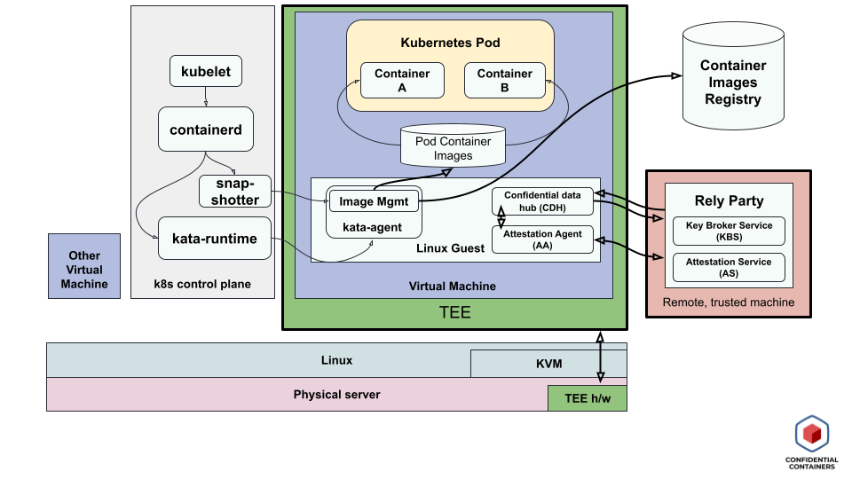

# Threat Model for Confidential Containers

In the simplest formulation of Confidential Containers, there is a guest
in the cloud, and the goal is to be protect it against threats originating
elsewhere in the cloud. These threats could include (for any node in the
cloud):
1. The host operating system
2. The cloud provider (which controls the host operating system)
3. Other virtual machines (and their processes) co-located in the same cloud
4. Any other processes on the host machine (including the kubernetes control plane).

Note that vulnerabilities that originate from inside the guest processes
Similarly, most Confidential Container platforms do not prevent against hardware
side channels.

One can reason about the threat model in terms of trusted execution environments
(TEEs). In Confidential Containers, the hardware and guest work in tandem to
establish a TEE for the guest. This provides isolation and integrity protection
for data in use. The following diagram shows what components in a Confidential
Containers setup are part of the TEE (outlined in a green box):

